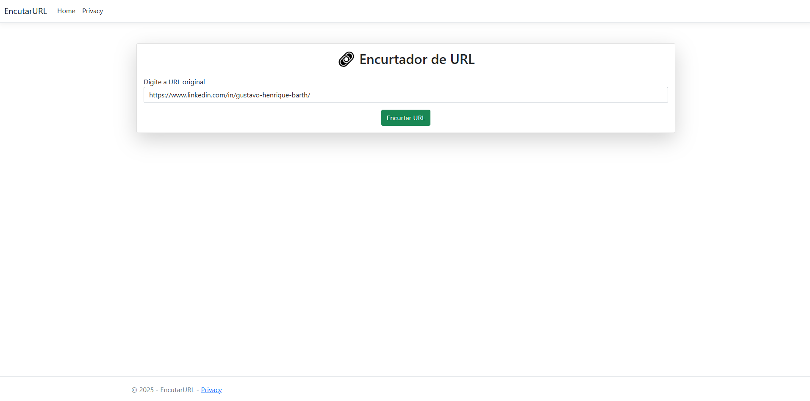
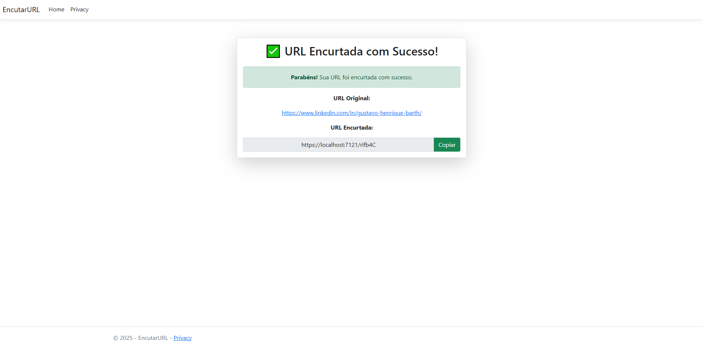

# Encurtador de URL

Um encurtador de URLs simples e eficiente feito em C# com .NET. Converta links longos em URLs curtas e fáceis de compartilhar!

## 🚀 Demonstração

#### Página inicial:

#### Página de retorno de sucesso:

## 🛠 Tecnologias utilizadas
* ✅ C# (.NET)
* ✅ Entity Framework Core
* ✅ MySQL (ou outro banco de dados configurado)
* ✅ Docker (opcional para rodar MySQL)

## 📌 Pré-requisitos
Antes de rodar o projeto, certifique-se de ter:

* 🔹 .NET SDK instalado
* 🔹 MySQL configurado ou usar Docker
* 🔹 Git instalado para clonar o repositório

## 💻 Como rodar o projeto

### 1️⃣ Clone o repositório
    git clone https://github.com/seu-usuario/seu-repositorio.git
    cd seu-repositorio

### 2️⃣ Configure o banco de dados
   Crie um banco de dados MySQL manualmente ou use Docker:
    
      docker run --name mysql-encurtador -e MYSQL_ROOT_PASSWORD=sua_senha -e MYSQL_DATABASE=encurtador_db -p 3306:3306 -d mysql
  Edite o appsettings.json para definir a conexão com o banco:
     
      "ConnectionStrings": {
    "DefaultConnection": "server=localhost;database=encurtador_db;user=root;password=sua_senha;"
    }

### 3️⃣ Restaure as dependências
    dotnet restore

### 4️⃣ Aplique as migrations
    dotnet ef database update

### 5️⃣ Rode a aplicação
    dotnet run

## 🤝 Contribuições
Fique à vontade para dar dicas e sua sugestão! Se tiver alguma dúvida, me avise.

📩 Linkedin: [www.linkedin.com/in/gustavo-henrique-barth]
📩 Email: [barthgustavo5@gmail.com]
